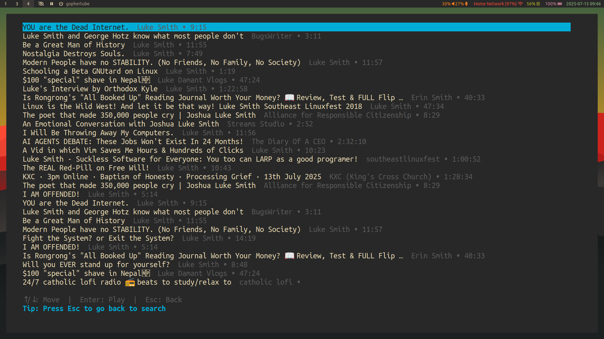
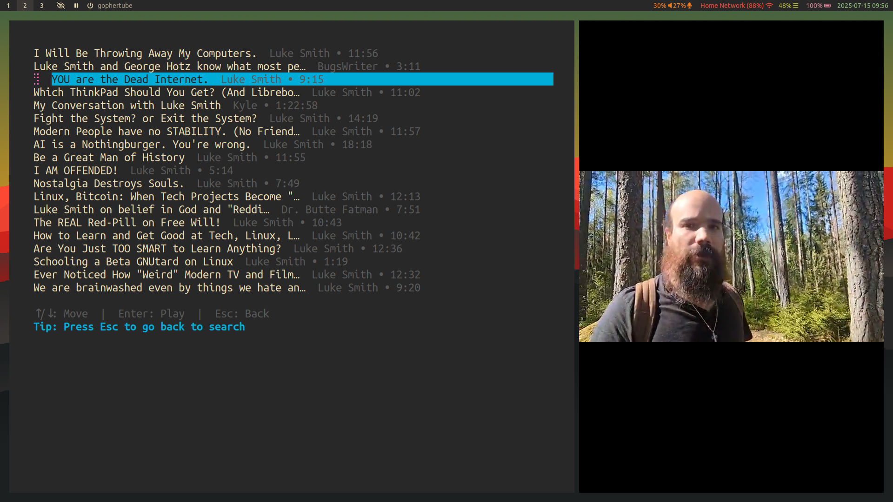

<div align="center">
  
</div>

# GopherTube

[](https://golang.org/dl/)
[](https://www.gnu.org/licenses/gpl-3.0)
[](https://github.com/KrishnaSSH/GopherTube)
[](https://github.com/KrishnaSSH/GopherTube/commits/main)
[](https://github.com/KrishnaSSH/GopherTube/graphs/contributors)
[](https://github.com/KrishnaSSH/GopherTube)
[](https://github.com/KrishnaSSH/GopherTube/issues)
[](https://github.com/KrishnaSSH/GopherTube/pulls)
[](https://github.com/KrishnaSSH/GopherTube/stargazers)

<!-- Discord Button -->
<p align="left">
  <a href="https://discord.gg/TqYvzbGJzb" target="_blank">
    
  </a>
</p>

A simple terminal YouTube client for searching and watching videos using [yt-dlp](https://github.com/yt-dlp/yt-dlp) and [mpv](https://mpv.io/).

---

## Overview

GopherTube is a terminal-based YouTube client. It scrapes and parses the youtube website to search YouTube and uses [mpv](https://mpv.io/) to play videos. The UI is built with Go and Bubble Tea, and is fully keyboard-driven.

**Main Demo**
<p align="left">
  
</p>
<p align="left">
  
  <br><em>searching for videos</em>
</p>
<p align="left">
  
  <br><em>Video playback in action</em>
</p>

## Features

- **Fast YouTube search** (scrapes YouTube directly, no API key needed)
- Play videos with [mpv](https://mpv.io/)
- Minimal terminal UI (Bubble Tea)
- Keyboard navigation (arrows, Enter, Tab, Esc, g/G)
- YAML config for paths and settings

## Who is this Project for?
- This Project is for everyone who enjoys Terminal apps
- For Everyone Who respects thier Privacy and Freedom
- Anyone who wants to watch videos while using as few system resources as possible — for example, if you have an older or low-spec machine that struggles to run YouTube in a full web browser, this project can help you cut down on resource usage.

---

## Prerequisites

- [Go 1.21+](https://go.dev/dl/)
- [mpv](https://mpv.io/) (media player)
- [yt-dlp](https://github.com/yt-dlp/yt-dlp) (YouTube downloader)

Install dependencies:

```bash
# Ubuntu/Debian
sudo apt install mpv
pip install yt-dlp

# macOS
brew install mpv yt-dlp

# Arch Linux
sudo pacman -S mpv yt-dlp
```

---

## Installation

**Quick Install (One-liner):**
```bash
curl -sSL https://raw.githubusercontent.com/KrishnaSSH/GopherTube/main/install.sh | bash
```

**Manual Installation:**
```bash
git clone https://github.com/KrishnaSSH/GopherTube.git
cd GopherTube
go build -o gophertube
./gophertube
```

Or use the Makefile:

```bash
make install # Install binary and man page
```

---

## Usage

- Start the app: `./gophertube`
- Type a search and press Enter
- Use ↑/↓ to move, Enter to play, Tab to load more, Esc to go back
- Spinner shows while video loads, then mpv opens
- **Watch for rotating tips at the bottom for helpful shortcuts!**

### Keyboard Shortcuts

| Key      | Action                  |
|----------|-------------------------|
| Enter    | Search / Play video     |
| ↑/↓      | Navigate video list     |
| Tab      | Load more videos        |
| g        | Go to first video       |
| G        | Go to last video        |
| Esc      | Go back / Quit          |

---

## Configuration

Create `~/.config/gophertube/gophertube.yaml`:

```yaml
mpv_path: "mpv"
ytdlp_path: "yt-dlp"
video_quality: "best[height<=1080]/best"
download_path: "~/Videos/gophertube"
search_limit: 8
```

See [config example](config/gophertube.yaml.example) for the full template.

---

## Project Structure

```
GopherTube/
├── main.go
├── Makefile
├── go.mod
├── go.sum
├── LICENSE
├── config/
│   └── gophertube.yaml.example
├── man/
│   └── gophertube.1
└── internal/
    ├── app/
    ├── components/
    ├── services/
    ├── types/
    ├── constants/
    ├── utils/
    └── errors/
```

## TODO

- [ ] Implement Vim bindings
- [ ] Add thumbnails support
- [ ] Add downloads support

[](https://www.star-history.com/#KrishnaSSH/GopherTube&Timeline)

---

## License

[](LICENSE)


---

## Contributing

PRs and issues welcome. 
