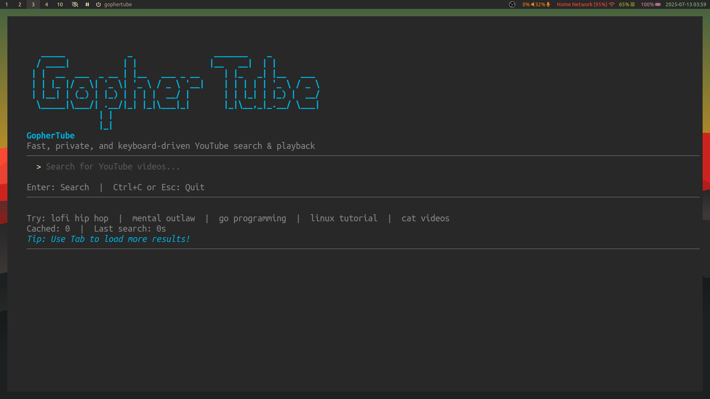

<div align="center">
  
</div>

# GopherTube

[](https://golang.org/dl/)
[](https://www.gnu.org/licenses/gpl-3.0)
[](https://github.com/KrishnaSSH/GopherTube)
[](https://github.com/KrishnaSSH/GopherTube/commits/main)
[](https://github.com/KrishnaSSH/GopherTube/graphs/contributors)
[](https://github.com/KrishnaSSH/GopherTube)
[](https://github.com/KrishnaSSH/GopherTube/issues)
[](https://github.com/KrishnaSSH/GopherTube/pulls)
[](https://github.com/KrishnaSSH/GopherTube/stargazers)

<!-- Discord Button -->
<p align="left">
  <a href="https://discord.gg/TqYvzbGJzb" target="_blank">
    
  </a>
</p>

A simple terminal YouTube client for searching and watching videos using [yt-dlp](https://github.com/yt-dlp/yt-dlp) and [mpv](https://mpv.io/).


---

## Overview

GopherTube is a terminal-based YouTube client. It scrapes and parses the youtube website to search YouTube and uses [mpv](https://mpv.io/) to play videos. The UI is built with Go and uses fzf, and is keyboard-driven.

**Screenshots**

<p align="left">
  
  <br><em>searching for videos</em>
</p>

**Demo Video**  
Watch the demo video [here](https://github.com/KrishnaSSH/GopherTube/raw/main/demo.mp4)


## Features

- **Fast YouTube search** (scrapes YouTube directly, no API key needed)
- Play videos with [mpv](https://mpv.io/)
- Minimal terminal UI (fzf)
- Keyboard navigation (arrows, Enter, Tab, Esc)
- TOML config 

## Who is this Project for?
- This Project is for everyone who enjoys Terminal apps
- For Everyone Who respects thier Privacy and Freedom
- Anyone who wants to watch videos while using as few system resources as possible — for example, if you have an older or low-spec machine that struggles to run YouTube in a full web browser, this project can help you cut down on resource usage.

---

## Prerequisites

- [Go 1.21+](https://go.dev/dl/)
- [mpv](https://mpv.io/) (media player)
- [fzf](https://github.com/junegunn/fzf) (fuzzy finder)
- [chafa](https://hpjansson.org/chafa/) (terminal image preview)

Install dependencies:

```bash
# Ubuntu/Debian
sudo apt install mpv fzf chafa

# macOS
brew install mpv fzf chafa

# Arch Linux (recommended)
yay -S gophertube
```

---

## Installation

**Quick Install (One-liner):**
```bash
curl -sSL https://raw.githubusercontent.com/KrishnaSSH/GopherTube/main/install.sh | bash
```

**Manual Installation:**
```bash
git clone https://github.com/KrishnaSSH/GopherTube.git
cd GopherTube
go build -o gophertube
./gophertube
```

---

## Usage

- Start the app: `./gophertube`
- Type a search and press Enter (or press Escape to exit)
- Use ↑/↓ to move, Enter to play, Tab to load more, Esc to go back to search
- Thumbnails and video info are shown in the preview
- mpv opens to play the selected video

### Keyboard Shortcuts

| Key      | Action                  |
|----------|-------------------------|
| Enter    | Search / Play video     |
| ↑/↓      | Navigate video list     |
| Tab      | Load more videos        |
| Esc      | Go back / Quit          |

---

## Configuration

Create `~/.config/gophertube/gophertube.toml`:

```toml
search_limit = 30
```

---

## TODO

- [x] Add thumbnails support
- [ ] Add downloads support

## Star History

<a href="https://www.star-history.com/#KrishnaSSH/GopherTube&Timeline">
 <picture>
   <source media="(prefers-color-scheme: dark)" srcset="https://api.star-history.com/svg?repos=KrishnaSSH/GopherTube&type=Timeline&theme=dark" />
   <source media="(prefers-color-scheme: light)" srcset="https://api.star-history.com/svg?repos=KrishnaSSH/GopherTube&type=Timeline" />
   
 </picture>
</a>

---

<!-- Donation Box -->
<div align="left">
  <h3>💖 Support GopherTube</h3>
  <p>If you find this project useful, consider supporting its development with crypto:</p>
  <table>
    <tr>
      <td></td>
      <td><code>bc1q78ymwmf33vr33ly8rpej7cqvr6cljjcdjf3g6p</code></td>
    </tr>
    <tr>
      <td></td>
      <td><code>ltc1qsfp4mdwwk3nppj278ayphqmkyf90xvysxp3des</code></td>
    </tr>
    <tr>
      <td></td>
      <td><code>0x6f786f482DDa360679791D90B7C8337655dC2199</code></td>
    </tr>
  </table>
</div>


## License

[](LICENSE)


---

## Contributing

PRs and issues welcome. 

See [CONTRIBUTING.md](CONTRIBUTING.md) for guidelines. 

---

